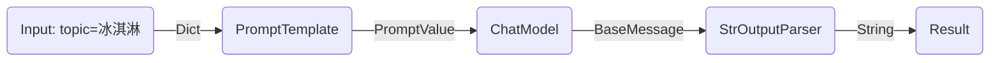

# LangChain Expression Language (LangChain表达式语言)

LangChain 表达式语言（LCEL）是一种轻松地将链组合在一起的声明性方式。 LCEL 从第一天起就被设计为**支持将原型投入生产，无需更改代码
**，从最简单的“提示词 + LLM”链到最复杂的链（我们已经看到人们在生产中成功运行了 100 个步骤的 LCEL 链）。下面是使用 LCEL
的一些原因：

- 支持流式传输（Streaming support）：使用 LCEL 构建链时，您可以获得最短的首次代币时间（直到第一个输出块出现之前经过的时间）。对于某些
  chain 来说，直接将 token 从 LLM 流式传输到流式输出解析器，可以以 LLM 提供者输出原始 toekn 相同的速率输出解析的结果。
- 支持异步（Async support）：LCEL 构建的任何链都可以使用同步 API（例如，在 Jupyter 中进行原型设计时）和异步 API（例如，在
  LangServe 服务器中）进行调用。这使得能够在原型设计和生产中使用相同的代码，并且具有出色的性能，能够在同一服务器中处理许多并发请求。
- 优化过并行执行（Optimized parallel execution）：只要你的 LCEL Chain
  具有可以并行执行的步骤（例如，从多个检索器获取文档），我们就会在同步和异步接口中自动执行此操作，以尽可能减少延迟。
- 重试和回退（Retries and fallbacks）：为 LCEL Chain 的任何部分配置重试和回退。这是让你的 Chain 在规模化的时候更加可靠的好方法。
- 输入和输出模式（Input and output modes）：输入和输出模式为每个 LCEL Chain 提供从链结构推断出的 Pydantic 和 JSONSchema
  模式。这可用于验证输入和输出，并且是 LangServe 的组成部分。
- 无缝集成 LangSmith（Seamless LangSmith tracing integration）：随着 Chain 变得越来越复杂，了解每一步到底发生了什么变得越来越重要。借助
  LCEL，所有步骤都会自动记录到 LangSmith，以实现最大程度的可观察性和可调试性。
- 无缝集成LangServe（Seamless LangServe deployment integration）：使用 LCEL 创建的任何 Chain 都可以使用 LangServe 轻松部署。

LCEL 可以轻松地从基本组件构建复杂的链，并支持开箱即用的功能，例如流式传输、并行性和日志记录。

### 基础案例: 提示词+LLM+输出解析器

最基本和常见的用例是将提示模板和模型链接在一起。为了看看这是如何工作的，让我们创建一个接受主题并生成笑话的链：

```python

import os

from dotenv import load_dotenv
from langchain.chat_models import ChatOpenAI
from langchain.prompts import ChatPromptTemplate
from langchain_core.output_parsers import StrOutputParser


def load_env():
    load_dotenv(verbose=True)

    openai_api_key = os.getenv("OPENAI_API_KEY")
    if openai_api_key is None:
        print("Please set OPENAI_API_KEY in your environment.")
        raise ValueError("Please set OPENAI_API_KEY in your environment.")


def test_basic_demo():
    prompt = ChatPromptTemplate.from_template("给我将一个关于{topic}的笑话")
    model = ChatOpenAI()
    output_parser = StrOutputParser()

    chain = prompt | model | output_parser

    res = chain.invoke({"topic": "冰淇淋"})
    print(f"type(res): {type(res)}, res: {res}")


def main():
    load_dotenv()
    test_basic_demo()


if __name__ == '__main__':
    main()
```


请注意这行代码，我们使用 LCEL 将不同的组件拼凑成一个链：

```python
chain = prompt | model | output_parser
```

`|` 符号类似于 unix 管道运算符，它将不同的组件链接在一起，将一个组件的输出作为下一个组件的输入。

在此链中，用户输入传递到提示词模板，然后提示模板词输出传递到模型，然后模型输出传递到输出解析器。让我们分别看一下每个组件，以真正了解发生了什么。

### 提示词（Prompt）

`prompt` 是一个 `BasePromptTemplate`，他接受一个关于模板变量的字典，然后返回`PromptValue`。

PromptValue 是一个完整提示的包装器，可以传递给 LLM （它接受一个字符串作为输入）或 ChatModel （它接受一个序列作为输入的消息）。

它可以与任何一种语言模型类型一起使用，因为它定义了生成 BaseMessage 和生成字符串的逻辑。

```python
from langchain_core.prompts import ChatPromptTemplate, BasePromptTemplate


def test_prompt():
    prompt = ChatPromptTemplate.from_template("给我将一个关于{topic}的笑话")
    print(f"{type(prompt)=}, {prompt=}\n")
    print(f"{isinstance(prompt, BasePromptTemplate)=}\n")
    prompt_value = prompt.invoke({"topic": "冰淇淋"})
    print(f"{type(prompt_value)=}, {prompt_value=}\n")
    msgs = prompt_value.to_messages()
    print(f"{type(msgs)=}, {msgs=}\n")
    s = prompt_value.to_string()
    print(f"{type(s)=}, {s=}")


def main():
    test_prompt()


if __name__ == '__main__':
    main()

```


### 模型（Model)

然后 `PromptValue` 被传递给 `model` 。

在本例中，我们的 `model` 是 `ChatModel` ，这意味着它将输出 `BaseMessage` 。

如果我们的 `model` 是 `LLM` ，它将输出一个字符串。

```python
import os

from dotenv import load_dotenv
from langchain.chat_models import ChatOpenAI
from langchain.prompts import ChatPromptTemplate
from langchain_community.llms.openai import OpenAI


def load_env():
    load_dotenv(verbose=True)

    openai_api_key = os.getenv("OPENAI_API_KEY")
    if openai_api_key is None:
        print("Please set OPENAI_API_KEY in your environment.")
        raise ValueError("Please set OPENAI_API_KEY in your environment.")


def test_chat_model():
    print(f"{'*' * 20} test_chat_model {'*' * 20}")
    prompt = ChatPromptTemplate.from_template("给我将一个关于{topic}的笑话")
    prompt_value = prompt.invoke({"topic": "冰淇淋"})
    print(f"{type(prompt_value)=}, {prompt_value=}\n")

    model = ChatOpenAI()

    message = model.invoke(prompt_value)
    print(f"{type(message)=}, message: {message}")


def test_llm_model():
    print(f"{'*' * 20} test_llm_model {'*' * 20}")
    prompt = ChatPromptTemplate.from_template("给我将一个关于{topic}的笑话")
    prompt_value = prompt.invoke({"topic": "冰淇淋"})
    print(f"{type(prompt_value)=}, {prompt_value=}\n")

    model = OpenAI(model="gpt-3.5-turbo-instruct")

    message = model.invoke(prompt_value)
    print(f"{type(message)=}, message: {message}")


def main():
    load_dotenv()
    test_chat_model()
    test_llm_model()


if __name__ == '__main__':
    main()

```

### 输出解析器（Output parser）

最后，我们将 `model` 输出传递给 `output_parser` ，这是一个 `BaseOutputParser` ，意味着它接受字符串或 `BaseMessage` 作为输入。

`StrOutputParser` 特别简单地将任何输入转换为字符串。

```python
import os

from dotenv import load_dotenv
from langchain.chat_models import ChatOpenAI
from langchain.prompts import ChatPromptTemplate
from langchain_community.llms.openai import OpenAI
from langchain_core.output_parsers import StrOutputParser


def load_env():
    load_dotenv(verbose=True)

    openai_api_key = os.getenv("OPENAI_API_KEY")
    if openai_api_key is None:
        print("Please set OPENAI_API_KEY in your environment.")
        raise ValueError("Please set OPENAI_API_KEY in your environment.")


def test_chat_model():
    print(f"{'*' * 20} test_chat_model {'*' * 20}")
    prompt = ChatPromptTemplate.from_template("给我将一个关于{topic}的笑话")
    prompt_value = prompt.invoke({"topic": "冰淇淋"})
    print(f"{type(prompt_value)=}, {prompt_value=}\n")

    model = ChatOpenAI()

    message = model.invoke(prompt_value)
    print(f"{type(message)=}, message: {message}")
    return message


def test_llm_model():
    print(f"{'*' * 20} test_llm_model {'*' * 20}")
    prompt = ChatPromptTemplate.from_template("给我将一个关于{topic}的笑话")
    prompt_value = prompt.invoke({"topic": "冰淇淋"})
    print(f"{type(prompt_value)=}, {prompt_value=}\n")

    model = OpenAI(model="gpt-3.5-turbo-instruct")

    message = model.invoke(prompt_value)
    print(f"{type(message)=}, message: {message}")
    return message


def test_output_parser():
    print(f"{'*' * 20} test_output_parser {'*' * 20}")
    parser = StrOutputParser()

    chat_message = test_chat_model()
    chat_res = parser.invoke(chat_message)
    print(f"{type(chat_res)=}, {chat_res=}")

    llm_message = test_llm_model()
    llm_res = parser.invoke(llm_message)
    print(f"{type(llm_res)=}, {llm_res=}")


def main():
    load_dotenv()
    test_output_parser()


if __name__ == '__main__':
    main()

```


### 完整的管道（Entirte Pipeline)

安装以下的步骤进行：

1. 将用户输入的 topic 构造成字典 `{"topic": "冰淇淋"}` 传入 `PromptTemplate`。
2. `prompt` 组件接收用户输入然后构造成一个 `PromptValue` 对象。
3. `model` 组件接收生成的提示词，然后将其传递给 LLM ，并将其输出转换成 `BaseMessage` 对象。
4. `output_parser` 组件接收 `BaseMessage` 对象或字符串，并将其转换成 Python 字符串。




请注意，如果您对任何组件的输出感到好奇，您始终可以测试链的较小版本，例如 `prompt` 或 `prompt | model` 以查看中间结果：

```python
input = {"topic": "ice cream"}

prompt.invoke(input)

(prompt | model).invoke(input)
```

## RAG搜索示例

对于我们的下一个示例，我们希望运行检索增强生成链以在回答问题时添加一些上下文。

首先需要安装依赖：
```bash
pip install langchain docarray tiktoken
# langchain 0.0.352 运行下面的案列会有bug，需要将pydantic版本降到1.10.8
pip install pydantic==1.10.8
# 由于Openai API接口每分钟限制3次，将模型换成阿里云通用千问，需要安装dashscope
pip install dashscope==1.13.6
```

```python
import os
import typing as t

from dotenv import load_dotenv
from langchain.prompts import ChatPromptTemplate
from langchain.vectorstores import DocArrayInMemorySearch
from langchain_community.chat_models.tongyi import ChatTongyi
from langchain_community.embeddings import DashScopeEmbeddings
from langchain_core.output_parsers import StrOutputParser
from langchain_core.runnables import RunnableParallel, RunnablePassthrough, RunnableSequence
from langchain_core.vectorstores import VectorStoreRetriever


def load_env():
    load_dotenv(verbose=True)

    openai_api_key = os.getenv("OPENAI_API_KEY")
    if openai_api_key is None:
        print("Please set OPENAI_API_KEY in your environment.")
        raise ValueError("Please set OPENAI_API_KEY in your environment.")


def get_test_texts():
    """获取测试用的文本信息"""
    texts = [
        "猴子吃香蕉”",
        "猫吃老鼠",
        "狗吃骨头",
        "王八吃绿豆糕"
    ]
    return texts


def get_retriever(texts: t.List[str]) -> VectorStoreRetriever:
    """获取检索器

    Args:
        texts: 向量库中存储的文本内容

    Returns: VectorStoreRetriever

    """
    vectorstore = DocArrayInMemorySearch.from_texts(texts, embedding=DashScopeEmbeddings())
    retriever = vectorstore.as_retriever()
    return retriever


def get_prompt_template() -> ChatPromptTemplate:
    template = """
    <指令>
        根据已知信息，简洁和专业的来回答问题。
        如果无法从中得到答案，请说 “根据已知信息无法回答该问题”，不允许在答案中添加编造成分，答案请使用中文。
    </指令>
    <已知信息>
        {context}
    </已知信息>
    <问题>
        {question}
    </问题>
    """
    prompt = ChatPromptTemplate.from_template(template)
    return prompt


def get_model():
    model = ChatTongyi()
    return model


def get_output_parser():
    output_parser = StrOutputParser()
    return output_parser


def get_rag_chain(retriever: VectorStoreRetriever) -> RunnableSequence:
    """获取rag chain

    Args:
        retriever: 检索器

    Returns: RunnableSequence

    """
    prompt = get_prompt_template()
    model = get_model()
    output_parser = get_output_parser()
    setup_and_retrieval = RunnableParallel(
        {"context": retriever, "question": RunnablePassthrough()}
    )
    chain = setup_and_retrieval | prompt | model | output_parser
    print(f"{type(chain)=}, {chain=}")
    return chain


def test_chain(chain, user_inputs: t.List[str]):
    outputs = chain.batch(user_inputs)
    for i, output in enumerate(outputs):
        user_input = user_inputs[i]
        print(f"Q:{user_input}\nA:{output}")


def main():
    load_env()
    texts = get_test_texts()
    retriever = get_retriever(texts)
    chain = get_rag_chain(retriever)
    test_inputs = ["猫吃什么？",
                   "王八吃什么？",
                   "猪吃什么？"]
    test_chain(chain, test_inputs)


if __name__ == '__main__':
    main()

```


## 为什么要使用 LCEL

> LCEL 可以轻松地从基本组件构建复杂的链条。它通过提供以下功能来实现这一点：
> 1. 统一的接口：每个 LCEL 对象都实现 Runnable 接口，该接口定义了一组通用的调用方法（ invoke 、 batch 、 stream 、 ainvoke 、...）。这使得 LCEL 对象链也可以自动支持这些调用。也就是说，每个 LCEL 对象链本身就是一个 LCEL 对象。
> 2. 组合原语：LCEL 提供了许多原语，可以轻松组合链、并行化组件、添加后置操作、动态配置链内部等。

具体看参考链接：[https://python.langchain.com/docs/expression_language/why](https://python.langchain.com/docs/expression_language/why)，这个里面介绍了使用 LCEL 带来的一些好处。


